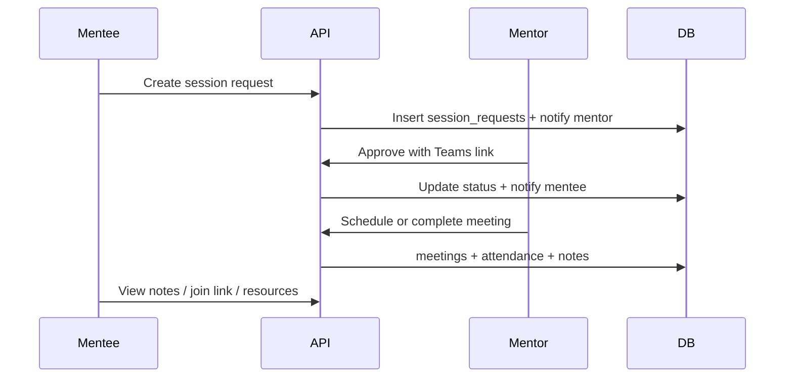
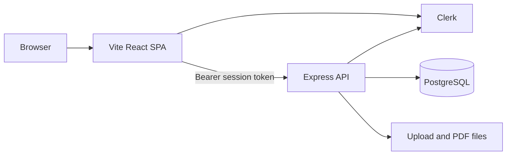
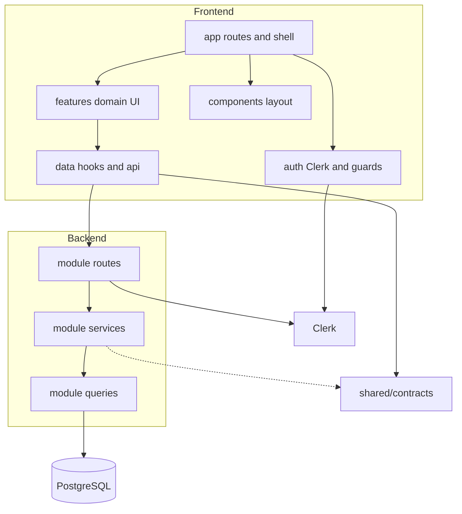
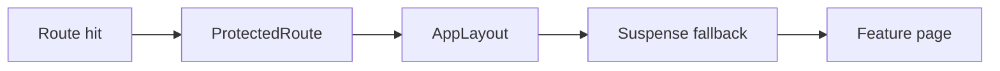
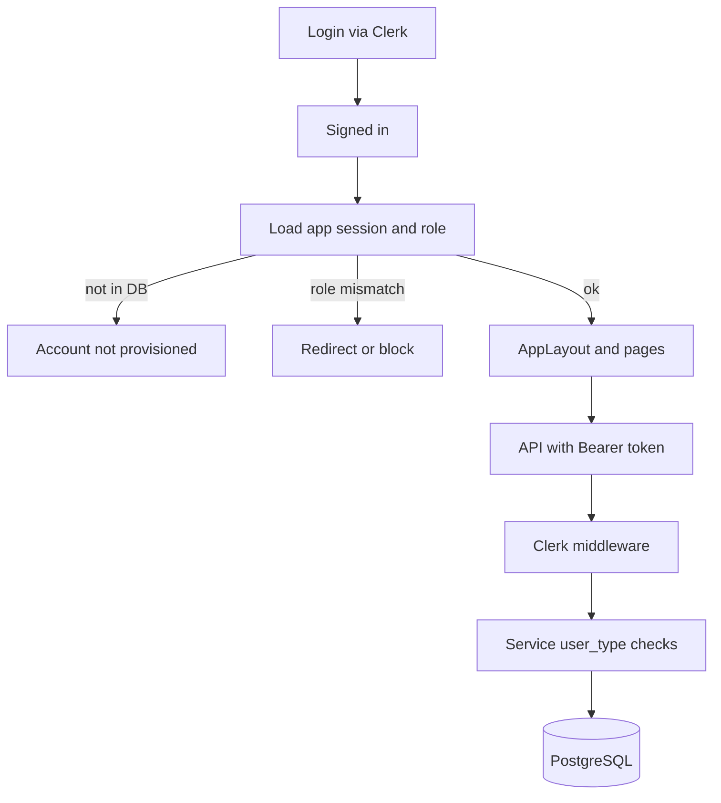
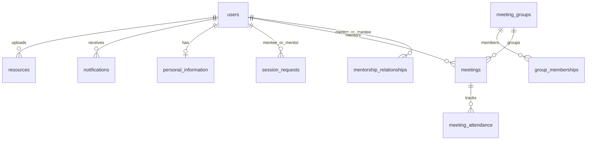
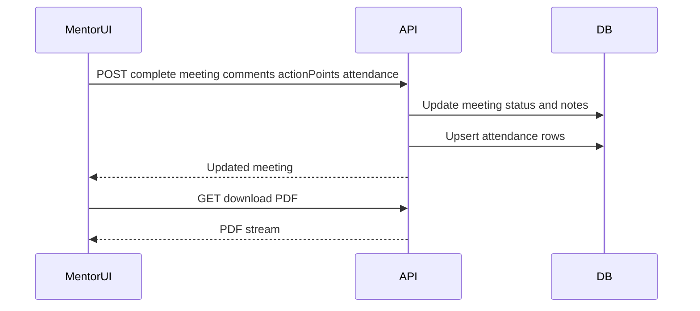
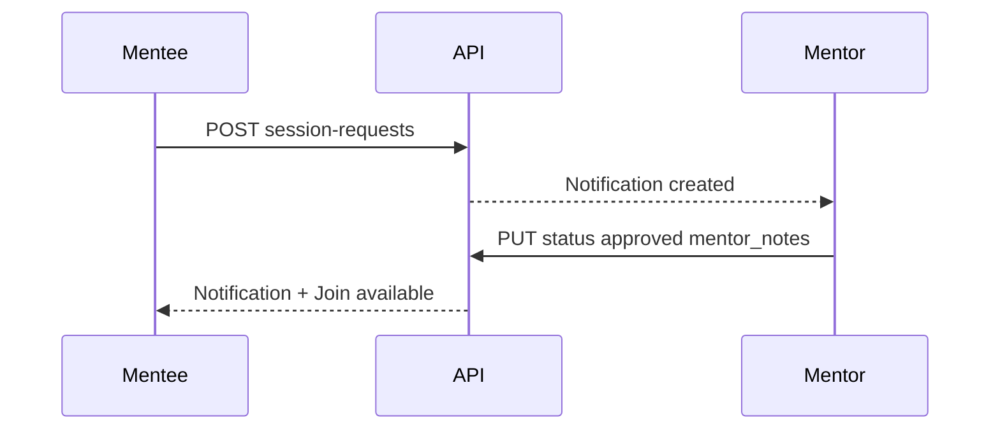
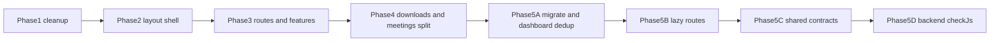

# Mentor Connect — System Design Document

| Field | Value |
|-------|--------|
| **Project** | Mentor Connect |
| **Document type** | Living architecture + decision log |
| **Audience** | Developers, reviewers, technical stakeholders |
| **Version** | 1.1 |
| **Last updated** | 2026-07-12 |
| **Live app** | [mentor-connect.up.railway.app](https://mentor-connect.up.railway.app) |

This is the **single source of truth** for product design, architecture, auth/ops setup, database seeding, and manual testing. The root [README.md](../README.md) is a short entry point that links here.

### How to read this document

1. **Sections 1–4** — product intent, actors, capabilities  
2. **Sections 5–8** — system and code architecture  
3. **Sections 9–12** — auth, data, contracts, cross-cutting  
4. **Section 13** — feature-by-feature deep dives  
5. **Sections 14–15** — decisions and refactor evolution  
6. **Sections 16–18** — setup, testing, glossary, appendix  

---

## 1. Title & purpose

Mentor Connect is a full-stack **academic mentorship ERP**: invite-only access for mentors and mentees, with meetings, 1-on-1 session requests, personal information, shared resources, notifications, and mentor reporting.

This document describes **current** system design after Phases 1–5 of frontend/backend structural modernization: feature slices, unified layout, React Query data layer, route lazy loading, shared TypeScript contracts, and backend `checkJs` against those contracts.

---

## 2. Executive / product overview

### What it is

A centralized web application that replaces ad-hoc email/spreadsheet mentorship workflows with:

- Role-based dashboards (mentor vs mentee)
- Scheduled group/general meetings and 1-on-1 personal sessions
- Mentee personal-information capture and mentor review/export
- Resource sharing (files and links)
- In-app notifications and activity feeds
- Mentor reports and PDF/CSV exports

### Primary actors

| Actor | Responsibility |
|-------|----------------|
| **Mentor** | Manages assigned mentees, schedules meetings, reviews session requests, uploads resources, generates reports |
| **Mentee** | Views assigned mentor, requests 1-on-1 sessions, joins meetings, maintains personal info, consumes resources |

### Core value flow



### Out of scope

- Public self-signup (access is provisioned in DB + Clerk)
- Native mobile apps
- Microservices / multi-tenant SaaS billing
- Full rewrite of backend to TypeScript (JS + `checkJs` is intentional)

---

## 3. Goals & non-goals

### Goals

- Clear **role-based UX** with one shared shell and role-specific nav
- Maintainable UI organized by **domain feature slices**
- Single **data access layer** (hooks → API clients → Express)
- Explicit **shared API contracts** between frontend and backend
- Faster first paint via **route-level code splitting**
- Type safety at the API boundary **without** forcing a backend runtime migration

### Non-goals

- Backend TypeScript compilation as the runtime
- ORM migration (data access is `pg` + SQL queries, not Prisma)
- Replacing Clerk with custom auth
- Pixel-perfect redesign of the existing shadcn visual system

---

## 4. Personas & capabilities matrix

| Area | Mentee | Mentor |
|------|--------|--------|
| **Dashboard** | Assigned mentor card, upcoming meetings, notifications preview | Stats (mentees, meetings, pending, completed), upcoming meetings, recent activity |
| **Meetings** | View scheduled/completed, join Teams, read notes | Create/edit/complete, attendance, download PDF |
| **Session requests** | Create/cancel; Join when approved | Approve/reject; optional Teams link in notes |
| **Personal info** | Full form save | — |
| **Mentees** | — | Search roster, open profile dialog, CSV export |
| **Resources** | List/download mentor materials | Upload file/link, manage list |
| **Notifications** | Full list, mark read / mark all | Activity on dashboard (no dedicated nav page) |
| **Reports** | — | Group report filters / CSV / PDF generation hooks |
| **Settings** | Profile + password setup | Profile (phone/cabin/availability/bio) + password |

### Navigation (source of truth)

From [`src/components/layout/nav.config.ts`](../src/components/layout/nav.config.ts):

**Mentee:** `/dashboard`, `/meetings`, `/mentorship-connect`, `/personal-info`, `/resources`, `/notifications`, `/settings`

**Mentor:** `/mentor/dashboard`, `/mentor/mentees`, `/mentor/meetings`, `/mentor/session-requests`, `/mentor/resources`, `/mentor/reports`, `/mentor/settings`

---

## 5. System context (C4 Level 1)



**Deployment model:** three-tier on Railway — frontend service, backend service, managed PostgreSQL. Frontend talks to backend via `VITE_API_BASE_URL`.

---

## 6. High-level architecture



### Layer responsibilities

| Layer | Path | Role |
|-------|------|------|
| App composition | [`src/app/`](../src/app/) | `App.tsx`, role route modules, `withAppLayout`, lazy pages, Suspense fallback |
| Features | [`src/features/`](../src/features/) | Domain UI: pages + components + presenters/schemas |
| Data | [`src/data/`](../src/data/) | API clients, React Query hooks/mutations, `AppDataProvider`, query keys |
| Auth | [`src/auth/`](../src/auth/) | Login route, `ProtectedRoute`, session/role resolution, password setup |
| Layout | [`src/components/layout/`](../src/components/layout/) | `AppLayout`, `AppShell`, `AppSidebar`, `AppTopbar`, `nav.config` |
| Shared contracts | [`shared/contracts/`](../shared/contracts/) | Transport DTOs shared conceptually by FE + BE |
| Backend modules | [`backend/src/modules/`](../backend/src/modules/) | `*.routes.js` → `*.service.js` → `*.queries.js` |
| Shared SQL helpers | [`backend/src/shared/queries/`](../backend/src/shared/queries/) | Cross-module profile/meetings/activity queries (dashboard) |

---

## 7. Frontend design

### 7.1 Composition root

[`src/app/App.tsx`](../src/app/App.tsx) wraps:

- `QueryClientProvider`
- `BrowserRouter`
- Public `/login/*`
- Mentee + mentor route trees
- Catch-all `NotFound`

Entry: [`src/main.tsx`](../src/main.tsx) imports `@/app/App`.

### 7.2 Route modules & shell

- [`mentee.routes.tsx`](../src/app/routes/mentee.routes.tsx)
- [`mentor.routes.tsx`](../src/app/routes/mentor.routes.tsx)
- [`withAppLayout.tsx`](../src/app/routes/withAppLayout.tsx)



**Why Suspense inside the shell:** auth and chrome (topbar/sidebar) stay eager; only main content waits on a lazy chunk ([`PageLoadingFallback.tsx`](../src/app/routes/PageLoadingFallback.tsx)).

### 7.3 Feature-slice convention

Typical feature layout:

```text
src/features/<domain>/
  pages/          # thin orchestration (hooks + composition)
  components/     # interactive / presentational pieces
  lib/            # presenters, zod schemas, mappers
```

Examples:

- `features/dashboard` — shared cards + mentee/mentor pages  
- `features/meetings` — tables, create/edit/complete dialogs, form schema  
- `features/session-requests` — mentee request UI + mentor review UI  
- `features/personal-info` — form page + `MenteeProfileDialog`  
- `features/mentees`, `resources`, `notifications`, `settings`

**Legacy holdout:** mentor Reports still lives at [`src/mentor/pages/Reports.tsx`](../src/mentor/pages/Reports.tsx) (lazy-loaded); not yet moved under `features/`.

### 7.4 Lazy loading strategy

Defined in [`lazy-pages.ts`](../src/app/routes/lazy-pages.ts):

| Eager | Lazy |
|-------|------|
| `MenteeDashboardPage`, `MentorDashboardPage` | meetings, session-requests, personal-info, resources, notifications, settings, mentees, reports |

**Why:** dashboards are first protected paint after login; secondary/heavier pages pay for their own chunks. Production build splits the main bundle (~478 KB gzipped main vs a prior single ~750 KB chunk before Phase 5B).

### 7.5 Data access rules

1. UI pages/components use **hooks** under `src/data/hooks/` (and mutations).
2. Hooks call **`src/data/api/*.api.ts`**.
3. Pages must **not** import `*.api.ts` directly (enforced by convention after Phase 4).
4. Types ideally come from `@/data/types/*`, which re-export `@shared/contracts/*`.

### 7.6 UI & client stack (actual)

| Technology | Role |
|------------|------|
| React 18 + Vite | SPA + bundler |
| TypeScript | Frontend type safety |
| React Router 6 | Routing |
| TanStack Query | Server state, cache, prefetch |
| Clerk React | Identity / session |
| Tailwind + shadcn/ui (Radix) | UI primitives |
| React Hook Form + Zod | Forms (e.g. meetings) |
| Lucide | Icons |

---

## 8. Backend design

### 8.1 Runtime

- **Node.js + Express**, CommonJS (`require` / `module.exports`)
- Entry: [`backend/src/server.js`](../backend/src/server.js)
- Data access: **`pg` pool + SQL** (not Prisma — README badge text is outdated)
- Auth middleware: `@clerk/express` `clerkMiddleware`
- Security: `helmet`, CORS allowlist, `morgan` logging
- Files: Multer uploads; PDFKit for PDFs

### 8.2 Module map & HTTP prefixes

| Module | Mount | Responsibility |
|--------|-------|----------------|
| auth | `/api/auth` | Session/role provisioning bridge |
| dashboard | `/api/dashboard` | Role-specific summary |
| users | `/api/users` | Profile, mentees, my-mentor |
| meetings | `/api/meetings` | CRUD, complete, PDF, mentee list |
| session-requests | `/api/session-requests` | Create, list, status, cancel |
| personal-info | `/api/personal-info` | Own form, mentee profile, CSV/PDF export |
| resources | `/api/resources` | List, upload, file serve |
| notifications | `/api/notifications` | List, unread, mark read |
| reports | `/api/reports` | Mentor report rows |

### 8.3 Internal pattern

```text
*.routes.js   → validate HTTP, call service, send status/body
*.service.js  → business rules, orchestration, envelopes { status, body }
*.queries.js  → SQL only
```

Dashboard is special: uses [`dashboard.mappers.js`](../backend/src/modules/dashboard/dashboard.mappers.js) + shared queries under `backend/src/shared/queries/`.

### 8.4 File / export flows

| Flow | Mechanism |
|------|-----------|
| Meeting notes PDF | Service streams PDFKit → response |
| Mentees personal-info CSV | Service builds CSV attachment |
| Mentee personal-info PDF | Service streams PDF |
| Resource files | Multer disk storage + authenticated file route |

Frontend wraps blobs via [`useDownloads.ts`](../src/data/hooks/useDownloads.ts) and related helpers.

### 8.5 Backend typing without TS runtime

- [`backend/tsconfig.json`](../backend/tsconfig.json): `allowJs` + `checkJs`, `noEmit`
- Services annotated with JSDoc `import('@shared/contracts/...')`
- Script: `npm run check:backend` (root) / `npm run check` (backend package)

**Why not migrate runtime to TypeScript:** low risk, preserves Express CommonJS ops model, still catches contract drift at the service boundary.

---

## 9. Auth & security design

### Model

Mentor Connect uses **Clerk for identity** and **PostgreSQL for authorization**.

1. **Clerk** authenticates (email OTP first-time, then password).
2. **PostgreSQL `users`** authorizes: only active, provisioned emails enter the app.
3. A Clerk-authenticated email that is **not** in the database is blocked (do not auto-create app users from Clerk signups).
4. Frontend resolves role via auth session API; `ProtectedRoute` enforces `allowedRole`.
5. API calls send Clerk **Bearer** session token ([`src/data/api/client.ts`](../src/data/api/client.ts)).
6. Backend middleware ([`backend/src/auth/auth.middleware.js`](../backend/src/auth/auth.middleware.js)):
   - Reads Clerk auth from `@clerk/express`
   - Loads Clerk user + primary email
   - Finds active `users` row by `clerk_user_id` or email
   - Links `clerk_user_id` on first successful provisioned login
   - Rejects unprovisioned, inactive, or invalid-role users
   - Sets `req.user` for downstream routes



### Auth API endpoints

| Method | Path | Purpose |
|--------|------|---------|
| `GET` | `/api/auth/session` | App session for valid Clerk token (`user`, `role`, `requiresPasswordSetup`) |
| `POST` | `/api/auth/password-setup-complete` | First-time password setup; updates Clerk password + `password_setup_completed` |
| `GET` | `/api/auth/verify` | Compatibility verify; returns active DB user |

**Disabled:** `POST /api/auth/login` and `POST /api/auth/register` no longer create app sessions. Passwords are handled by Clerk.

**Error codes:** `UNAUTHENTICATED`, `EMAIL_MISSING`, `USER_NOT_PROVISIONED`, `USER_INACTIVE`, `ACCOUNT_LINK_CONFLICT`, `INVALID_ROLE`, `AUTHENTICATION_FAILED`.

### Sign-in flow

1. Open `/login` → choose **Email code**.
2. Enter a provisioned email → verify Clerk OTP.
3. Redirect to role dashboard (`/dashboard` or `/mentor/dashboard`).
4. If first login, a banner under the topbar directs you to **Settings → Security** to set a password.
5. Later visits: email code **or** password.
6. Password changes after setup use the Clerk client (`user.updatePassword`) on the frontend; no extra backend endpoint.

### Blocked cases

- Email not in database → not provisioned  
- Inactive DB user → blocked  
- Invalid role → blocked  
- Password login before first OTP/password setup → use email code first  

### Auth environment

**Frontend (`.env.local`):**

```bash
VITE_CLERK_PUBLISHABLE_KEY=pk_...
VITE_API_BASE_URL=http://localhost:5001/api
```

**Backend (`backend/config.env`):**

```bash
CLERK_PUBLISHABLE_KEY=pk_...
CLERK_SECRET_KEY=sk_...
DATABASE_URL=...
CORS_ORIGIN=http://localhost:8080,http://127.0.0.1:8080
CLERK_AUTHORIZED_PARTIES=http://localhost:8080,http://127.0.0.1:8080
```

`CLERK_PUBLISHABLE_KEY` is required on the backend for `@clerk/express`. Without it, hosted auth routes fail.

### Production (Railway + Clerk)

Use the **same** Clerk application keys on frontend and backend services.

Frontend service:

```bash
VITE_CLERK_PUBLISHABLE_KEY=pk_...
VITE_API_BASE_URL=https://<your-backend-service>.up.railway.app/api
```

Backend service:

```bash
CLERK_PUBLISHABLE_KEY=pk_...
CLERK_SECRET_KEY=sk_...
DATABASE_URL=postgresql://...
CORS_ORIGIN=https://<your-frontend-service>.up.railway.app
CLERK_AUTHORIZED_PARTIES=https://<your-frontend-service>.up.railway.app
FRONTEND_URL=https://<your-frontend-service>.up.railway.app
NODE_ENV=production
```

Clerk Dashboard: add hosted frontend domain under allowed origins; use production `pk_` / `sk_` keys for production; redeploy after env changes.

Health check:

```bash
curl https://<your-backend-service>.up.railway.app/api/health
```

Expect `"clerkConfigured": true`. If false, set missing Clerk env vars on the backend and redeploy.

### Security controls

- Invite/provision-only access (no open registration; do not auto-provision from Clerk)
- Do not store new app passwords in the database (Clerk owns passwords)
- Role checks on both client routes and server services
- CORS origins + Clerk authorized parties aligned with frontend URL
- Helmet headers on API
- Health endpoint available even if Clerk env is missing (returns config status)

---

## 10. Data model & persistence

Schema source: [`database/schema.sql`](../database/schema.sql) (includes Clerk columns `clerk_user_id`, `password_setup_completed`, `last_login_at` and mentor fields `cabin`, `availability`).

### Database folder files

| File | Purpose |
|------|---------|
| [`database/schema.sql`](../database/schema.sql) | Full PostgreSQL schema (tables, indexes, triggers) |
| [`database/create-2-test-users.cjs`](../database/create-2-test-users.cjs) | Seed local test mentor/mentee |
| [`database/sync-clerk-test-users.cjs`](../database/sync-clerk-test-users.cjs) | Link test users to Clerk (`clerk_user_id`) |
| [`database/cleanup-test-data.cjs`](../database/cleanup-test-data.cjs) | Remove test users and related data |

### Fresh database setup

Requires `DATABASE_URL` (and Clerk keys for sync) in `backend/config.env` or the environment:

```bash
psql "$DATABASE_URL" -f database/schema.sql
node database/create-2-test-users.cjs
node database/sync-clerk-test-users.cjs
```

Test emails must exist in Clerk and be able to receive OTP codes:

- Mentor: `chawdarohan16@gmail.com`
- Mentee: `rohanc1604@gmail.com`

### Core entities

| Table | Purpose |
|-------|---------|
| `users` | Mentors/mentees; `user_type`, `clerk_user_id`, profile fields |
| `mentorship_relationships` | Active mentor↔mentee links |
| `meeting_groups` / `group_memberships` | Group meeting structure |
| `meetings` | Scheduled/completed sessions |
| `meeting_attendance` | Per-mentee attendance |
| `session_requests` | 1-on-1 request workflow |
| `resources` / `resource_permissions` | Shared materials |
| `notifications` | In-app alerts |
| `personal_information` | Extended mentee demographics/family/address |
| `reports` | Stored report metadata |

### Relationship sketch



### Naming convention

- **DB and JSON wire format:** primarily `snake_case` (`preferred_date`, `meeting_time`, `is_read`, …)
- **Exception:** meeting create/update/complete request bodies use **camelCase** (`meetingDate`, `actionPoints`) to match Express validators — documented in shared contracts as intentional dual convention

---

## 11. API & contracts design

### Shared contracts package

[`shared/contracts/`](../shared/contracts/):

| File | Types (examples) |
|------|------------------|
| `common.ts` | `ApiMessage`, `ApiResult`, `AuthUser`, `SessionRequestStatus` |
| `users.ts` | `UserProfile`, `Mentee`, `MentorInfo`, `DashboardStats` |
| `dashboard.ts` | `DashboardSummary` |
| `meetings.ts` | `Meeting`, `MeetingSummary`, create/update/complete inputs |
| `session-requests.ts` | `SessionRequest`, create/update inputs |
| `personal-info.ts` | `PersonalInfo`, `MenteeProfile`, save input |
| `resources.ts` | `Resource`, create request/response |
| `notifications.ts` | `Notification`, unread/mark-all |
| `reports.ts` | `Report` |

Path alias: `@shared/*` → `./shared/*` (Vite + `tsconfig.app.json` + `backend/tsconfig.json`).

### Frontend wiring

- API clients typed with generics (`apiClient.get<T>`)
- [`src/data/types/*.ts`](../src/data/types/) re-export shared DTOs (stable `@/data/types` imports)
- `CreateResourceInput` extends shared fields with browser `File` on the client only

### Backend wiring

- Service JSDoc references `@shared/contracts/...`
- No runtime import of TypeScript from Node — types are compile-time only via `tsc --noEmit`

---

## 12. Cross-cutting concerns

### React Query

- Central keys: [`query-keys.ts`](../src/data/api/query-keys.ts)
- Mutations invalidate domain keys **and often** `dashboard.summary`
- [`AppDataProvider`](../src/data/providers/AppDataProvider.tsx) (inside `AppLayout`) prefetches dashboard + role-relevant queries after session resolves

### Downloads

Dedicated hooks (`useDownloads`, meeting report helpers) keep blob handling and filenames out of page components.

### Errors & toasts

UI uses `@/hooks/use-toast` for success/failure; API client throws `Error` with server `message` when present.

### Loading UX

- Auth gate: “Checking access…”
- Lazy routes: spinner in main content (`PageLoadingFallback`)
- Feature pages: local loading empty states

### Environment

See **§9 Auth environment** and **§9 Production** for the full frontend/backend variable lists (`VITE_*`, Clerk, `DATABASE_URL`, CORS, authorized parties).

---

## 13. Feature deep-dives

### 13.1 Dashboard

**Purpose:** First landing after login; overview without navigating every domain.

| Role | Page | Notable UI |
|------|------|------------|
| Mentee | `features/dashboard/pages/MenteeDashboardPage.tsx` | `AssignedMentorCard`, upcoming meetings, notification preview |
| Mentor | `features/dashboard/pages/MentorDashboardPage.tsx` | `StatsCardGrid`, upcoming meetings, activity badges |

**Shared:** [`dashboard-presenters.tsx`](../src/features/dashboard/lib/dashboard-presenters.tsx), `UpcomingMeetingsCard`, etc.  
**API:** `GET /api/dashboard/summary` → `DashboardSummary`

### 13.2 Meetings

**Mentee:** list scheduled/completed; join Teams; view notes.  
**Mentor:** create/edit/complete with attendance; download completed meeting PDF.

**UI:** `features/meetings/pages/*`, dialogs, `meeting-form.schema.ts`  
**API:** `/api/meetings`, `/api/meetings/:id/complete`, `/api/meetings/:id/download`



### 13.3 Session requests / Mentorship Connect

**Mentee (`/mentorship-connect`):** request form (title, date, time, description); cancel pending; Join opens `mentor_notes` URL when approved.  
**Mentor (`/mentor/session-requests`):** tabs pending/approved/rejected; approve/reject; Teams link stored in `mentor_notes`.

**Wire fields:** `title` / `description` (not UI-era `topic`/`comments`).  
**API:** `/api/session-requests`



### 13.4 Personal info + mentee profile

**Mentee:** large form → `POST /api/personal-info`.  
**Mentor:** `MenteeProfileDialog` loads `GET /api/personal-info/mentee/:id`; optional PDF download.

### 13.5 Mentees roster

**Mentor:** search/filter assigned mentees; open profile; CSV export of personal info.  
**API:** `GET /api/users/mentees`, export under personal-info routes.

### 13.6 Resources

**Mentor:** upload file (PDF/DOC) or link via FormData.  
**Mentee:** list mentor’s resources; download files.  
**API:** `/api/resources`

### 13.7 Notifications

**Mentee page:** list + mark one / mark all.  
**Mentor:** recent activity on dashboard (session/meeting oriented).  
**API:** `/api/notifications`

### 13.8 Reports

**Mentor:** time-range filters over meetings/mentees; CSV helpers; group report generation hook.  
**Location:** still `src/mentor/pages/Reports.tsx` (tech debt vs other features).  
**API:** `/api/reports` (+ client-side meeting data for some exports)

### 13.9 Settings

Shared `SettingsPage`: profile card + security/password card. Mentor profile fields include cabin/availability.

---

## 14. Architecture decision records (ADRs)

| ID | Decision | Alternatives considered | Reason chosen |
|----|----------|-------------------------|---------------|
| ADR-1 | **Feature folders** (`src/features/<domain>`) | Keep `mentee/pages` + `mentor/pages` forever | Domain cohesion; shared UI for both roles; clearer ownership |
| ADR-2 | **Unified `AppLayout` + `nav.config`** | Separate MentorLayout/MenteeLayout shells | One chrome implementation; role only changes nav items |
| ADR-3 | **TanStack Query + `src/data` layer** | Fetch in components / Redux | Cache, prefetch, invalidation; pages stay thin |
| ADR-4 | **Clerk for identity** | Custom JWT/password-only | OTP + password, hosted UI, less auth surface area |
| ADR-5 | **DB-provisioned authorization** | Anyone with Clerk account | Institutional control; invite-only |
| ADR-6 | **Express modules routes→service→queries** | Fat routes / Prisma-only services | Clear boundaries; SQL stays explicit; no microservices needed |
| ADR-7 | **`pg` + SQL schema** | Prisma (mentioned in older README) | Existing schema and queries already work; avoid ORM rewrite mid-flight |
| ADR-8 | **Shared contracts + FE typing first** | Duplicate interfaces in every page | Single transport truth; less drift |
| ADR-9 | **Backend `checkJs` + JSDoc, keep JS runtime** | Full backend TypeScript migration | Type-check services against contracts without deploy/runtime risk |
| ADR-10 | **Route-level lazy loading; dashboards eager** | Lazy everything / nothing | Cut main bundle; protect first paint |
| ADR-11 | **Preserve snake_case wire format** | Big-bang rename to camelCase everywhere | Match DB/API reality; mappers optional later |
| ADR-12 | **shadcn/ui + existing Tailwind tokens** | New design system | Consistency and speed; avoid redesign during architecture work |
| ADR-13 | **Downloads via dedicated hooks** | Call API blobs from pages | Reuse filename/toast patterns; keep pages free of API details |
| ADR-14 | **Suspense inside layout** | Suspend entire route including sidebar | Shell remains interactive while page chunk loads |

---

## 15. Evolution (Phases 1–5)



| Phase | Intent | Outcome |
|-------|--------|---------|
| **1** | Dead code, wire notifications, standardize imports | Cleaner hooks; notifications route usable |
| **2** | Unify layout | `AppLayout` / `AppSidebar` / `nav.config`; delete dual layouts |
| **3** | Modular routes + feature folders | `src/app`, meetings/resources/notifications/settings features |
| **4** | Download hooks; split mentor meetings | No direct API in pages; meeting dialogs/components |
| **5A** | Migrate remaining legacy pages; dashboard dedup | dashboard, session-requests, personal-info, mentees features |
| **5B** | Code splitting | `lazy-pages` + Suspense in shell |
| **5C** | Shared contracts | `shared/contracts`, typed APIs, remove local DTOs |
| **5D** | Backend typecheck | JSDoc services + `npm run check:backend` |

---

## 16. Quality, testing & ops

### Prerequisites

- Node.js 20+
- PostgreSQL 15+
- Git
- Clerk application (publishable + secret keys)

### Install

```bash
git clone https://github.com/rc-dev16/mentor-connect.git
cd mentor-connect
npm install
cd backend && npm install && cd ..
```

### Local startup

```bash
# Terminal 1 — API (default PORT from config, often 5001)
cd backend
npm run dev

# Terminal 2 — SPA (Vite, port 8080)
npm run dev
```

- Frontend: http://localhost:8080  
- Backend health: http://localhost:5001/api/health  

Configure env as in **§9 Auth environment** and apply schema/seed as in **§10 Fresh database setup**.

### Scripts

| Command | Purpose |
|---------|---------|
| `npm run dev` | Vite frontend (port 8080 by default) |
| `npm run build` | Production frontend build |
| `npm run check:backend` | `tsc -p backend/tsconfig.json` (checkJs) |
| `cd backend && npm run dev` | Nodemon API |
| `cd backend && npm run check` | Same backend typecheck |
| `cd backend && npm test` | Jest (if tests present) |

### Manual testing

**Test users** (one active mentorship links them):

- Mentor: `chawdarohan16@gmail.com`
- Mentee: `rohanc1604@gmail.com`

Use **separate browser contexts** (normal + incognito) so Clerk sessions do not overlap.

**First login**

1. Open `/login` → Email code → provisioned email → OTP  
2. Confirm redirect: mentor → `/mentor/dashboard`, mentee → `/dashboard`  
3. Password setup banner → Settings → Security card → set password  

**Later login:** email code or password.

**Scenarios to verify**

- Password banner until password is set; Security card supports setup and change  
- Shared topbar layout for both roles  
- Mentor can view linked mentee; role routes redirect away from the other role  
- Non-provisioned Clerk email blocked; inactive DB user blocked  

**Feature smoke paths**

- Mentee: login → dashboard → mentorship-connect → personal-info → resources → notifications  
- Mentor: login → dashboard → mentees → meetings → session-requests → reports  

### Deployment (Railway)

Three-tier: PostgreSQL + Express API + Vite frontend. Auth is Clerk (invite-only). Env alignment is documented in **§9 Production**.

### Known limitations / tech debt

- Mentor **Reports** page not yet under `features/`
- No `.github/workflows` CI in repo (typecheck/build not automated in-git)
- Dual naming on meetings request vs response bodies must stay documented when changing APIs
- Older marketing copy may still mention Prisma/Recharts; runtime uses `pg` + SQL

---

## 17. Glossary

| Term | Meaning |
|------|---------|
| **Mentee** | Student user (`user_type = mentee`) |
| **Mentor** | Faculty/staff mentor (`user_type = mentor`) |
| **Session request** | Mentee-initiated 1-on-1 ask (`session_requests`) |
| **Meeting** | Mentor-scheduled session with optional attendance/notes |
| **Personal info** | Extended mentee demographics form (`personal_information`) |
| **Resource** | Shared file or link uploaded by mentor |
| **Contract / DTO** | Shared TypeScript type describing API wire shape |
| **Feature slice** | Folder under `src/features` owning one domain’s UI |
| **checkJs** | TypeScript checking of JS files via JSDoc without emitting JS |
| **App shell** | Topbar + sidebar + main chrome around page content |

---

## 18. Appendix

### A. Full route map

| Path | Role | Page module | Load |
|------|------|-------------|------|
| `/login/*` | public | `LoginRoute` | eager |
| `/dashboard` | mentee | `MenteeDashboardPage` | eager |
| `/meetings` | mentee | `MenteeMeetingsPage` | lazy |
| `/mentorship-connect` | mentee | `MenteeSessionRequestsPage` | lazy |
| `/personal-info` | mentee | `PersonalInfoPage` | lazy |
| `/resources` | mentee | `MenteeResourcesPage` | lazy |
| `/notifications` | mentee | `MenteeNotificationsPage` | lazy |
| `/settings` | mentee | `SettingsPage` | lazy |
| `/mentor/dashboard` | mentor | `MentorDashboardPage` | eager |
| `/mentor` | mentor | redirect → dashboard | — |
| `/mentor/mentees` | mentor | `MentorMenteesPage` | lazy |
| `/mentor/meetings` | mentor | `MentorMeetingsPage` | lazy |
| `/mentor/session-requests` | mentor | `MentorSessionRequestsPage` | lazy |
| `/mentor/resources` | mentor | `MentorResourcesPage` | lazy |
| `/mentor/reports` | mentor | `mentor/pages/Reports` | lazy |
| `/mentor/settings` | mentor | `SettingsPage` | lazy |

### B. Condensed folder tree

```text
MENTOR_CONNECT/
  docs/SYSTEM_DESIGN.md          ← this document
  shared/contracts/              ← API DTOs
  src/
    app/                         ← App, routes, lazy, Suspense
    auth/                        ← Clerk login, guards, password
    components/layout/           ← App shell + nav
    data/                        ← api, hooks, types, providers
    features/                    ← domain UI
    mentor/pages/Reports.tsx     ← legacy holdout
  backend/src/
    server.js
    auth/
    modules/*/                   ← routes, service, queries
    shared/queries/
  database/schema.sql
```

### C. Script cheat sheet

```bash
# Frontend
npm run dev
npm run build
npm run check:backend

# Backend
cd backend && npm run dev
cd backend && npm run check

# Database
psql "$DATABASE_URL" -f database/schema.sql
node database/create-2-test-users.cjs
node database/sync-clerk-test-users.cjs
```

### D. Test accounts (local seed)

- Mentor: `chawdarohan16@gmail.com`
- Mentee: `rohanc1604@gmail.com`

### E. API reference (selected)

| Method | Endpoint | Description | Access |
|--------|----------|-------------|--------|
| GET | `/api/auth/session` | App session + role | Signed-in |
| GET | `/api/dashboard/summary` | Role dashboard summary | Role |
| GET | `/api/users/profile` | Current user profile | All |
| GET | `/api/users/my-mentor` | Assigned mentor | Mentee |
| GET | `/api/users/mentees` | Assigned mentees | Mentor |
| GET/POST | `/api/meetings` | List / create meetings | Role |
| POST | `/api/meetings/:id/complete` | Complete + attendance | Mentor |
| GET/POST | `/api/session-requests` | List / create requests | Role |
| PUT | `/api/session-requests/:id/status` | Approve/reject | Mentor |
| GET/POST | `/api/personal-info` | Read / save personal info | Mentee |
| GET | `/api/personal-info/mentee/:id` | Mentee profile | Mentor |
| GET/POST | `/api/resources` | List / upload resources | Role |
| GET | `/api/notifications` | Notifications | All |

Full module mounts are listed in **§8.2**.

---

*End of System Design Document.*
